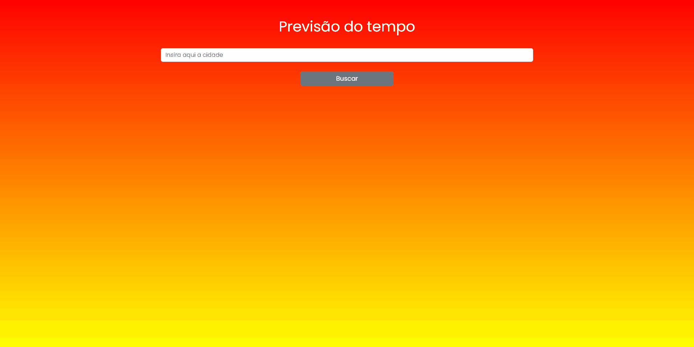

<h1>Clima ☀️</h1>
<h2>Descrição</h2>
<p style='font-size:16px'>
  Aplicação desenvolvida para compor o repositório. Inspirado num desafio proposto em 2016 para um processo seletivo pela 1STi. Link para o repositório do desafio: https://github.com/1STi/desafio-frontend
  <br/>
  OBS: a API usada no projeto não está mais dispónivel.
  <br/>
  Link para a <a href='https://www.weatherapi.com/'>API</a> usada.
</p>
<hr />
<h2>Publicação</h2>
<p align='center' style='font-size:17px'>Acesse a página hospedada pelo Vercel <a href='https://clima-mocha.vercel.app/'>aqui</a>.</p>
</br>
<p><strong>OBS: </strong>Acontece um erro ao usar da api pelo vercel. Recomenda-se baixar o projeto para utilizar suas features. </p>
<hr/>
<h2>Frameworks e bibliotecas:</h2>
<ul style='font-size:17px'>
  <li>
    <a href='https://nextjs.org/'>NextJs</a>
  </li>
  <li>
    <a href='https://reactjs.org/'>React</a>
  </li>
  <li>
    <a href='https://axios-http.com/ptbr/'>Axios</a>
  </li>
  <li>
    <a href='https://getbootstrap.com/'>Bootstrap</a> |
    <a href='https://reactstrap.github.io/?path=/story/home-installation--page'>Reactstrap</a>
  </li>
</ul>
<hr />
<h2>Demo 📷</h2>
<div display='flex'> 
  
  
</div>
<hr/>
<h2>Como rodar na sua máquina</h2>
<h3 style='font-size:16px'>Pré-requisitos:</h3>
<p style='font-size:16px'>Para rodar o projeto, é preciso que você tenha as ferramentas <a href='https://git-scm.com/'>Git</a> e <a href='https://nodejs.org/en/'>Node.js</a>. Além de também ser interessante um editor de código, como o <a href='https://code.visualstudio.com/'>VsCode</a>. </p>

```bash
#Clone este repositório
git clone https://github.com/davimoreiraa/Clima.git

#Acesse a pasta usando o terminal
cd clima

#Instale as depedências
npm install

#Execute a aplicação
npm run dev
```

<hr/>
<footer>
  <p style='font-size:17px'>🍊 Made by Davi Moreira | See my 
    <a href="https://www.linkedin.com/in/davi-moreira-dos-santos-804280203/">LinkedIn</a>
  </p>
</footer>
